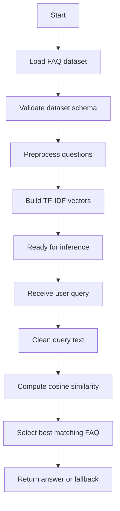

# Workflow Diagram

```mermaid
flowchart TD
  A[Start] --> B[Load FAQ dataset]
  B --> C[Validate dataset schema]
  C --> D[Preprocess questions]
  D --> E[Build TF-IDF vectors]
  E --> F[Ready for inference]
  F --> G[Receive user query]
  G --> H[Clean query text]
  H --> I[Compute cosine similarity]
  I --> J[Select best matching FAQ]
  J --> K[Return answer or fallback]
```
